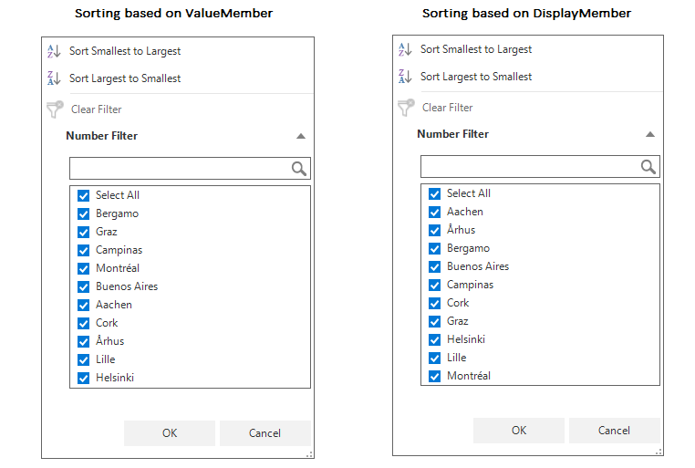

# How to sort checkbox items in the FilterPopup based on the DisplayValue in WinForms DataGrid (SfDataGrid)?

## About the sample

This example illustrates how to sort checkbox items in the FilterPopup based on the DisplayValue in [WinForms DataGrid](https://www.syncfusion.com/winforms-ui-controls/datagrid)(SfDataGrid).

By default, in [WinForms DataGrid](https://www.syncfusion.com/winforms-ui-controls/datagrid) (SfDataGrid) [GridComboBoxColumn](https://help.syncfusion.com/cr/windowsforms/Syncfusion.WinForms.DataGrid.GridComboBoxColumn.html) the checkbox elements in the FilterPopup will be sorted based on the edit value (ValueMember) of the column. You can sort the checkbox elements in the FilterPopup based on the display value (DisplayMember) of the column by handling the [SfDataGrid.FilterPopupShown](https://help.syncfusion.com/cr/windowsforms/Syncfusion.WinForms.DataGrid.SfDataGrid.html#Syncfusion_WinForms_DataGrid_SfDataGrid_FilterPopupShown) event. 

```C#

public Form1()
{
    InitializeComponent();
    sfDataGrid1.DataSource = new OrderInfoCollection().OrderDetails;

    this.sfDataGrid1.FilterPopupShown += OnSfDataGrid_FilterPopupShown;
}
private void OnSfDataGrid_FilterPopupShown(object sender, Syncfusion.WinForms.DataGrid.Events.FilterPopupShownEventArgs e)
{
    if (e.Column.MappingName == "ShipCityID")
    {
        e.Control.CheckListBox.View.SortDescriptors.Add(new SortDescriptor()
        {
            PropertyName = "DisplayText",
            Direction = ListSortDirection.Ascending,
        });
    }
}


```




## Requirements to run the demo

Visual Studio 2015 and above versions.


